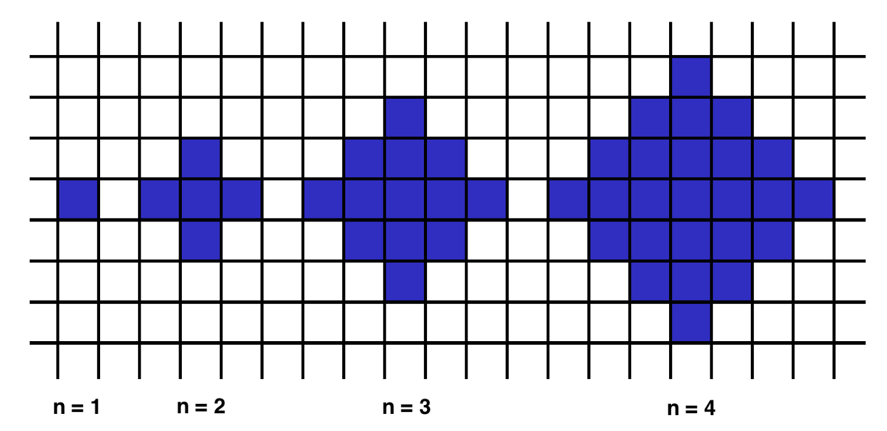

## Problem:

Below we will define an `n`-interesting polygon. Your task is to find the area of a polygon for a given `n`.

A `1`-interesting polygon is just a square with a side of length `1`. An `n`-interesting polygon is obtained by taking the `n - 1`-interesting polygon and appending `1`-interesting polygons to its rim, side by side. You can see the `1`-, `2`-, `3`- and `4`-interesting polygons in the picture below.

## Example:

For `n = 2`, the output should be: `shapeArea(n) = 5`.
For `n = 3`, the output should be: `shapeArea(n) = 13`.

## usage

`coffee index.coffee <n>`

`<n>` is a real number.

note: if coffeescript is installed as a global package and index.coffee has execute permissons just execute it as `index.coffee <n>`

